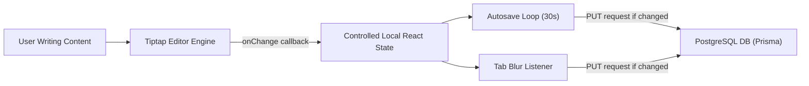

# Vionsys CMS: Editor Canvas Architecture

This document describes the design and flow of the editor canvas, which is the main centerpiece of this CMS.

## Main Workspace Flow

---

## Editor Components Structure

Located inside `src/components/cms/editor/`:
- **ContentEditorShell**: The orchestrator page wrapper. Maintains forms state, autosave timers, preview redirects, and publish validation triggers.
- **RichTextEditor**: Integrates the Tiptap engine, bubble editing menus, custom blocks dropdown, and binds with the Media Library Picker modal.
- **ContentIntelligenceBar**: The bottom statistics bar calculating word counts, reading time, keyword density, and checking semantic heading structures.

---

## Custom Block Injector Architecture

Writers can inject complex modular layouts (like FAQs, Stats, CTAs, and Testimonials) without coding.
1. **Insertion**: The toolbar inserts these blocks as pre-styled semantic HTML snippets with distinct classes (e.g. `
...
`).
2. **Output**: The database stores two forms of editor output:
   - `contentJson`: The complete raw Tiptap state object for editor recovery.
   - `contentHtml`: Clean, sanitized, semantic HTML for frontend presentation.

---

## Autosave & Version History

- **Autosave triggers**:
  - Periodically every 30 seconds if changes are detected.
  - Instantly on window `blur` or browser tab navigation focus change.
- **Debouncing**: Changes are captured in memory first and saved to the database in debounced intervals rather than on every keystroke.
- **Version Control**: The server retains the last 20 content states per document. Re-saving creates a new audit trail history entry, purging older states past the 20-version ceiling.
